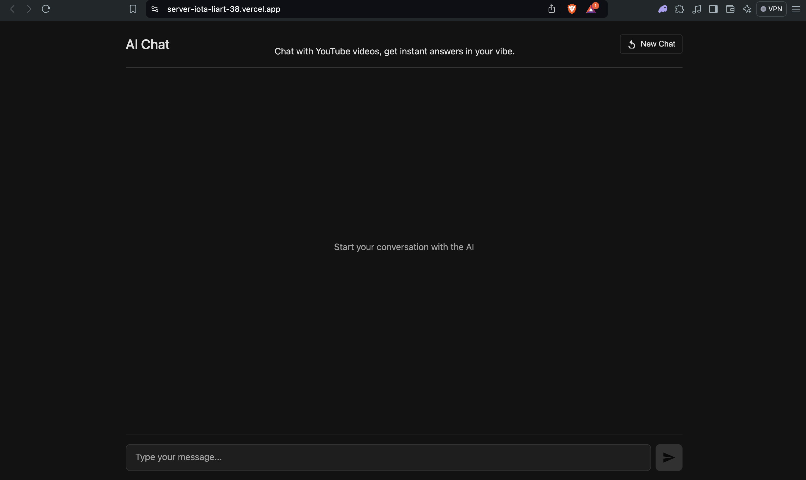
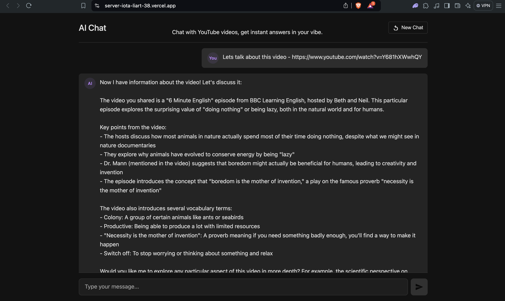
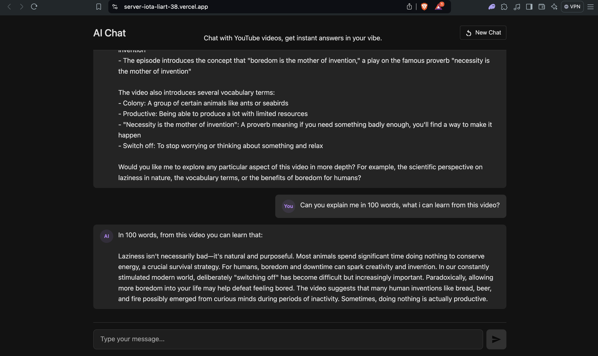

# GenZ AI Chat Agent 🎧🤖

A modern AI-powered agentic chat application that integrates **YouTube video understanding** using **RAG (Retrieval Augmented Generation)**, **LangGraph**, **LangChain**, **Claude API**, **Bright Data scraping**, and **PostgreSQL-backed vector store**.

Hosted Live: [https://server-iota-liart-38.vercel.app/](https://server-iota-liart-38.vercel.app/)

---

## 📸 Demo Screenshots

<div align="center">
  
  <br/><br/>
  
  <br/><br/>
  
</div>

---

## 🚀 Tech Stack
- **React** (Frontend)
- **TypeScript**
- **Node.js** (Backend)
- **Express.js**
- **LangChain** (Tool orchestration and agent management)
- **LangGraph** (Stateful multi-step agent flow)
- **RAG (Retrieval Augmented Generation)** (Dynamic retrieval of YouTube video transcripts)
- **Agentic AI** (React Agent with memory for conversational context)
- **Claude-3 Sonnet API (Anthropic)** (LLM used for responses)
- **Bright Data API** (Web scraping for YouTube transcripts)
- **Vector Store with PostgreSQL** (Postgres-backed similarity search and document storage)

---

## 💡 Project Description
GenZ AI is a **YouTube video assistant** that can:
- Answer questions about YouTube videos.
- Scrape YouTube video transcripts using **Bright Data**.
- Use **RAG** to retrieve contextually relevant video information.
- Remember the ongoing conversation using **Thread IDs**.

It combines the power of **LangChain tools, agentic AI flows, web scraping, PostgreSQL-based vector storage, and Claude-3 Sonnet API** to provide **intelligent, context-aware responses.**

---

## 🔄 Application Flow

1. **User sends a message:**  
   If the message contains a YouTube URL → The agent identifies it using URL patterns.

2. **Bright Data Integration:**  
   If the video transcript is not already present in the vector store, the agent triggers a **Bright Data scrape job** via webhook to fetch the transcript.

3. **Storage & Retrieval:**  
   The transcript is processed and added to a **PostgreSQL-backed vector store** for similarity searches.

4. **RAG Flow:**  
   For follow-up questions, the agent retrieves the most relevant transcript chunks based on the query and provides precise answers using **Claude-3 Sonnet API.**

5. **Thread ID:**  
   Maintains conversation memory using a `thread_id` passed from the frontend to ensure continuity of context.

---

## 🛠️ Features
- 🔗 YouTube video understanding via scraping and transcript retrieval.
- 🧠 Agentic AI with memory and context tracking.
- 🔍 RAG-based document retrieval for accurate answers.
- 🗄️ Vector storage using **PostgreSQL** for scalable retrieval.
- ⚡ Real-time chat interface.
- 🔄 New Chat option to reset conversation and memory.
- 🌐 Fully deployed on **Vercel**.

---

## 📂 Project Structure
```plaintext
├── backend
│   ├── agent.js             # Agent setup with LangChain & LangGraph
│   ├── embeddings.js        # Vector store management (Postgres-backed)
│   ├── brightdata.js        # Bright Data scraping trigger
│   ├── index.js             # Express server & routes
├── frontend
│   ├── App.tsx              # React chat interface
│   ├── index.css            # Styling
├── screenshots              # Demo screenshots (1.png, 2.png, 3.png)
├── README.md
├── package.json
└── vite.config.js
